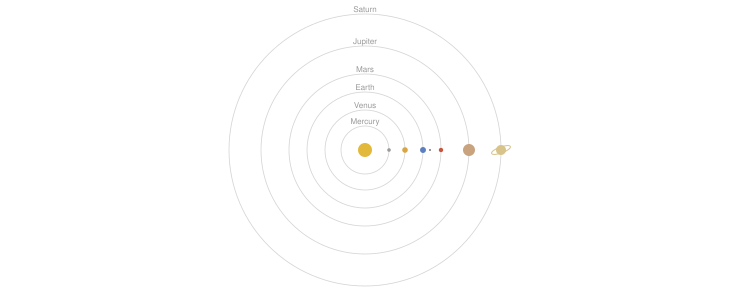

### Hi, I'm Manisha

I'm a data analyst in Lisbon. I work with Power BI, SQL, and Python. I like to explain numbers with charts and small examples.

Most of what I make is on [manisha-subedi.github.io](https://manisha-subedi.github.io).

The planets above move at their real relative speeds. One Earth year takes 12 seconds, so Mercury goes round in 3 and Saturn needs almost 6 minutes.
